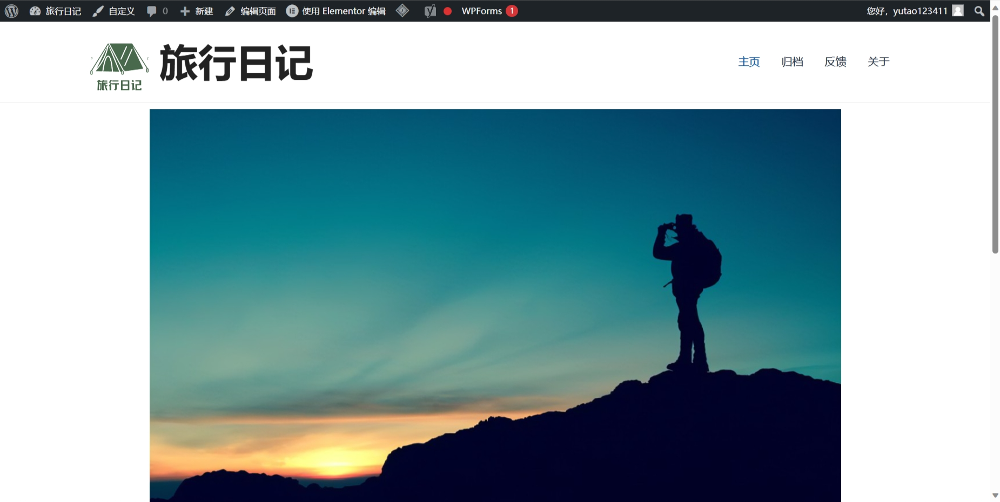
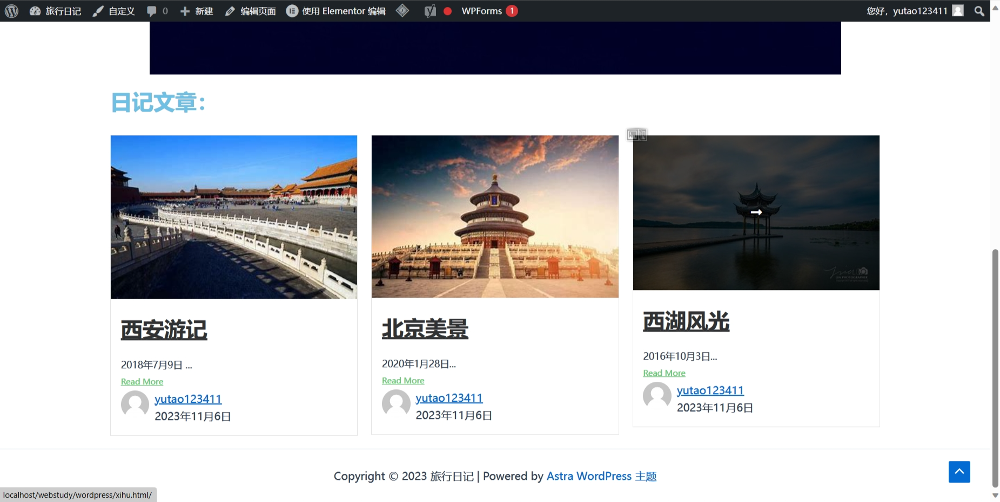
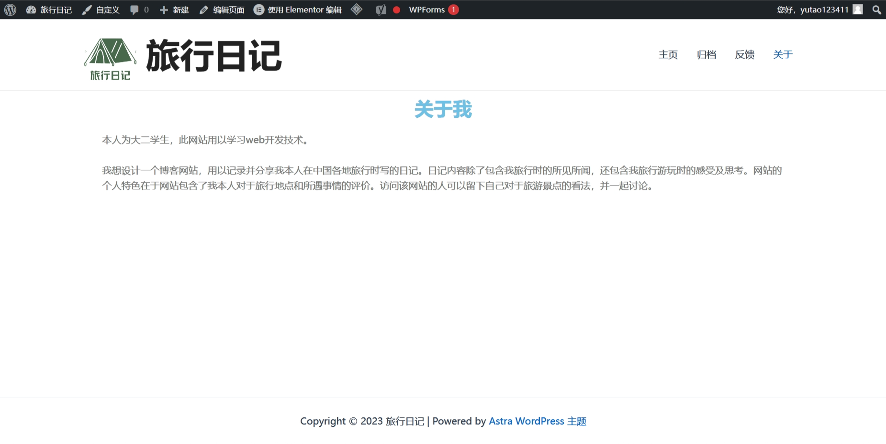

<html>
<body>
  

<a name="546"/>

  <h1 style="line-height: 160%; box-sizing: content-box; font-weight: 700; font-size: 41px; border-bottom: 3px double #999; color: #000; margin-top: 14px;">项目立项</h1>
<h2 style="line-height: 160%; box-sizing: content-box; font-weight: 700; font-size: 34px; border-bottom: 1px solid #dbdbdb; color: #333;">网站概述：</h2>

我想设计一个博客网站，用以记录并分享我本人在<strong style="line-height: 160%; box-sizing: content-box; font-weight: 700;">中国各地旅行时写的日记</strong>。日记内容除了包含我旅行时的<strong style="line-height: 160%; box-sizing: content-box; font-weight: 700;">所见所闻</strong>，还包含我旅行游玩时的<strong style="line-height: 160%; box-sizing: content-box; font-weight: 700;">感受及思考</strong>。网站的<strong style="line-height: 160%; box-sizing: content-box; font-weight: 700;">个人特色</strong>在于网站包含了<strong style="line-height: 160%; box-sizing: content-box; font-weight: 700;">我本人对于旅行地点和所遇事情的评价</strong>。访问该网站的人可以留下自己对于旅游景点的看法，并一起讨论。

<h2 style="line-height: 160%; box-sizing: content-box; font-weight: 700; font-size: 34px; border-bottom: 1px solid #dbdbdb; color: #333;">对标参考的网站：</h2>

无色墨水 - 一个人的领地 (wuse.ink) 
阿呆日记 (dai.ge) 
笔记星球 (note-star.cn) 
君子不器 – Colin Jiang的博客

<h2 style="line-height: 160%; box-sizing: content-box; font-weight: 700; font-size: 34px; border-bottom: 1px solid #dbdbdb; color: #333;">内容来源及素材：</h2>

内容来源于我从小在全国各地游玩时记录的旅行日记。

<h2 style="line-height: 160%; box-sizing: content-box; font-weight: 700; font-size: 34px; border-bottom: 1px solid #dbdbdb; color: #333;">基本界面：</h2>

从别人博客上截图下来的界面。我的设计大体与之一致。 
 
 
 
 

<h2 style="line-height: 160%; box-sizing: content-box; font-weight: 700; font-size: 34px; border-bottom: 1px solid #dbdbdb; color: #333;">媒体类型说明：</h2>

网站里除了包含我记录的旅行日记文字，还会包含旅行时拍下的有关景点的图片。图片将附在日记文字的最后面。访问该网站的游客可以欣赏到我所旅行的美景及游玩的项目情景。

</body></html>
